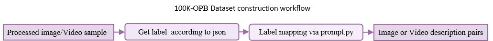

# 100k-OPB Dataset

This repository contains the **100K-OPB Dataset** used in *ORACLE: Knowledge-Efficient Pig Behaviour Recognition via Ontology-Guided Contrastive Learning*. The dataset can be downloaded from: [Download 100K-OPB Dataset](https://drive.google.com/drive/folders/1eSx2iyFkp69vD50YM5I-ei9dm1GnOst8?usp=sharing). The collection integrates publicly available pig images and videos and converts visual samples into image-description pairs for ontology-guided contrastive learning.



## 1. Overview

The collection was built from **9 public pig-behaviour data sources or publications** and is organized into **18 source split folders** plus one all-split source. The raw public-source table contains **104,787 visual samples** in total, including **76,431 training samples**, **16,157 testing samples**, and **12,199 samples** from the all-split LiR2024 source.

After label cleaning and category normalization, the processed dataset contains **102,420 labelled samples** across **24 normalized pig-behaviour categories**. The processed split contains **88,445 training samples** and **13,975 testing samples**.

The small difference between the raw-source total and the processed total is expected. The raw-source table reports dataset-level counts from the collected public sources, whereas the processed table reports samples retained after harmonizing labels, resolving duplicate or incompatible label names, and constructing the final train-test records used by this repository.

The dataset covers common pig behaviours and posture/activity states, including lying, standing, walking, eating, drinking, fighting, no-fight, investigating, sleeping, sitting, mounting, nose-to-nose interaction, lateral lying, sternal lying, feeder/waterer-related states, and feeding/drinking posture combinations.

Core metadata files are:

```text
train.json
test.json
correct_json.py
```

Before using the dataset on a new machine, run `correct_json.py` to convert the paths in `train.json` and `test.json` into absolute paths that match the local storage location.

## 2. Download and organization of public datasets

The public datasets were downloaded from the corresponding publication repositories, Mendeley Data, GitHub sources, or Roboflow Universe pages. Each source was kept as an independent folder before label preprocess. This design keeps the original data provenance traceable.

### 2.1 Source-level dataset table

| No. | Dataset folder / split | Stored data type | Behaviour categories | Samples | License | Citation or source |
|---:|---|---|---|---:|---|---|
| 1 | `LiR2024-12199` (All) | Images/videos | Drinking<br>Eating<br>Standing<br>Walking | 12,199 | Github License | Li R et al. Multi-behavior detection of group-housed pigs based on YOLOX and SCTS-SlowFast |
| 2 | `Riekert2020-3604-train` (Train) | Images | PigLying<br>pigNotlying | 3,242 | Github License | Riekert et al. Automatically detecting pig position and posture by 2D camera imaging and deep learning |
| 2 | `Riekert2020-3274-test` (Test) | Images | PigLying<br>pigNotlying | 3,604 | Github License | Riekert et al. Automatically detecting pig position and posture by 2D camera imaging and deep learning |
| 3 | `Riekert2021-7963-train` (Train) | Images | pigLying<br>pigNotlying | 7,963 | Github License | Riekert et al. Model selection for 24/7 pig position and posture detection by 2D camera imaging and deep learning |
| 3 | `Riekert2021-2286-test` (Test) | Images | pigLying<br>pigNotlying | 2,286 | Github License | Riekert et al. Model selection for 24/7 pig position and posture detection by 2D camera imaging and deep learning |
| 4 | `JiH2023-6328-train` (Train) | Videos | Fight<br>Nofight | 6,328 | Github License | Ji H et al. Efficient aggressive behavior recognition of pigs based on temporal shift module |
| 4 | `JiH2023-2109-test` (Test) | Videos | Fight<br>Nofight | 2,109 | Github License | Ji H et al. Efficient aggressive behavior recognition of pigs based on temporal shift module |
| 5 | `GaoY2023-664-train` (Train) | Videos | Fight<br>Nofight | 664 | Github License | Gao Y et al. Recognition of Aggressive Behavior of Group-housed Pigs Based on CNN-GRU Hybrid Model with Spatio-temporal Attention Mechanism |
| 5 | `GaoY2023-221-test` (Test) | Videos | Fight<br>Nofight | 221 | Github License | Gao Y et al. Recognition of Aggressive Behavior of Group-housed Pigs Based on CNN-GRU Hybrid Model with Spatio-temporal Attention Mechanism |
| 6 | `Zhang2025-16204-train` (Train) | Images | Lying<br>Sleeping<br>Investigating<br>Eating<br>Walking<br>Moutend | 16,204 | CC BY 4.0 | https://data.mendeley.com/datasets/y5b89bsv69/1 |
| 6 | `Zhang2025-4263-test` (Test) | Images | Lying<br>Sleeping<br>Investigating<br>Eating<br>Walking<br>Moutend | 4,262 | CC BY 4.0 | https://data.mendeley.com/datasets/y5b89bsv69/1 |
| 7 | `Maria2025-2580-train` (Train) | Images | Walking | 2,580 | CC BY 4.0 | https://universe.roboflow.com/maria-dnxxx/pig-behavior-sjdya |
| 7 | `Maria2025-126-test` (Test) | Images | Walking | 126 | CC BY 4.0 | https://universe.roboflow.com/maria-dnxxx/pig-behavior-sjdya |
| 8 | `Km2025-9881-train` (Train) | Images | Active<br>Drink<br>Eat<br>Fight<br>Investigating<br>Lying<br>nose-to-nose<br>Sitting<br>Standing<br>walk | 9,881 | CC BY 4.0 | https://universe.roboflow.com/km-sd0ce/pig-behavior-wlvku |
| 8 | `Km2025-1361-test` (Test) | Images | Active<br>Drink<br>Eat<br>Fight<br>Investigating<br>Lying<br>nose-to-nose<br>Sitting<br>Standing<br>walk | 1,361 | CC BY 4.0 | https://universe.roboflow.com/km-sd0ce/pig-behavior-wlvku |
| 9 | `Swine2025-29569-train` (Train) | Images | Feeder<br>Lateral Lying<br>Sitting Drinking<br>Sitting Feeding<br>Sitting NF<br>Standing Drinking<br>Standing Feeding<br>Standing NF<br>Sternal Lying Drinking<br>Sternal Lying Feeding<br>Sternal Lying NF<br>Waterer | 29,569 | CC BY 4.0 | https://universe.roboflow.com/swine-tktu8/pig-behavior-8xbgn/dataset/1 |
| 9 | `Swine2025-2188-test` (Test) | Images | Feeder<br>Lateral Lying<br>Sitting Drinking<br>Sitting Feeding<br>Sitting NF<br>Standing Drinking<br>Standing Feeding<br>Standing NF<br>Sternal Lying Drinking<br>Sternal Lying Feeding<br>Sternal Lying NF<br>Waterer | 2,188 | CC BY 4.0 | https://universe.roboflow.com/swine-tktu8/pig-behavior-8xbgn/dataset/1 |


### 2.2 Processed label distribution

| Normalized label | Train | Test | Total | Source datasets |
|---|---:|---:|---:|---|
| Lying | 12,216 | 2,377 | 14,593 | Km2025; Riekert2020; Riekert2021; Zhang2025 |
| Eating | 10,130 | 2,314 | 12,444 | Km2025; LiR2024; Swine2025; Zhang2025 |
| Walking | 8,354 | 1,357 | 9,711 | Km2025; LiR2024; Maria2025; Zhang2025 |
| Sternal lying NF | 7,479 | 603 | 8,082 | Swine2025 |
| Sleeping | 7,451 | 144 | 7,595 | Zhang2025 |
| Standing | 5,650 | 1,822 | 7,472 | Km2025; LiR2024 |
| Lateral Lying | 6,199 | 408 | 6,607 | Swine2025 |
| Fight | 4,030 | 1,244 | 5,274 | GaoY2023; JiH2023; Km2025 |
| Investigating | 4,621 | 646 | 5,267 | Km2025; Zhang2025 |
| No Fight | 3,515 | 1,171 | 4,686 | GaoY2023; JiH2023 |
| Standing NF | 3,914 | 291 | 4,205 | Swine2025 |
| Not Lying | 2,853 | 427 | 3,280 | Riekert2020; Riekert2021 |
| Drinking | 2,667 | 290 | 2,957 | Km2025; LiR2024; Swine2025 |
| Standing Feeding | 2,733 | 202 | 2,935 | Swine2025 |
| Mounting | 1,597 | 269 | 1,866 | Zhang2025 |
| Sitting NF | 1,518 | 128 | 1,646 | Swine2025 |
| Standing Drinking | 1,267 | 96 | 1,363 | Swine2025 |
| Sitting Feeding | 663 | 43 | 706 | Swine2025 |
| Sternal Lying Drinking | 447 | 29 | 476 | Swine2025 |
| Sternal Lying Feeding | 429 | 35 | 464 | Swine2025 |
| Nose-to-nose | 256 | 39 | 295 | Km2025 |
| Active | 187 | 23 | 210 | Km2025 |
| Sitting Drinking | 165 | 5 | 170 | Swine2025 |
| Sitting | 104 | 12 | 116 | Km2025 |


## 3. Data processing

The processing procedure converts heterogeneous public pig-behaviour datasets into a unified image-description pair dataset.

### 3.1 Source preservation

Each public dataset was first stored under an independent source folder. Source-specific train and test splits were preserved when provided by the original dataset. This allows users to trace each processed sample back to its source dataset.

### 3.2 Path and sample indexing

Each visual sample was indexed through `train.json` or `test.json`. A typical JSON record contains at least:

```json
{
  "original_label": "No Fight",
  "input": "Analyze this image: /absolute/path/to/sample.mp4",
  "output": "This pig is no fight"
}
```

The `input` field stores the visual sample path. The `original_label` field stores the label inherited from the source dataset. The `output` field stores a text response associated with the target behaviour.

Because absolute paths differ across machines, users should run:

```bash
python correct_json.py
```

This script should be placed under the dataset root folder. It rewrites the sample paths in `train.json` and `test.json` according to the local dataset directory.

### 3.3 Label preprocess

Original labels from different sources were unified into **24 unified categories**. For example, source-specific labels such as `PigLying`, `pigLying`, and `Lying` were mapped to a unified label where appropriate. Case differences and spacing differences were ignored during unification.

The final unified labels are listed in Section 2.2. This step is necessary because different public datasets use different annotation conventions for similar pig behaviours.

### 3.4 Positive and negative text construction

For each visual sample, the unified label was used to retrieve behaviour descriptions from `prompt.py`. The prompt file defines text templates or description sets for each behaviour category.

The construction logic is:

```text
image or video sample
    -> read label from train.json or test.json
    -> unify the original label
    -> retrieve positive and negative descriptions from prompt.py
    -> construct image-description pairs
```

For each sample, positive descriptions are semantically consistent with the normalized label. Negative descriptions are sampled from behaviours that are semantically different from the target category. This produces contrastive image-description pairs suitable for positive-negative contrastive learning.


## 4. Dataset construction and storage

### 4.1 Dataset root

The recommended dataset root is:

```text
PigBehaviourDataset/
```

A typical directory structure is:

```text
PigBehaviourDataset/
├── GaoY2023-221-test/
├── GaoY2023-664-train/
├── JiH2023-2109-test/
├── JiH2023-6328-train/
├── Km2025-1361-test/
├── Km2025-9881-train/
├── LiR2024-12199-test/
├── LiR2024-12199-train/
├── Maria2025-126-test/
├── Maria2025-2580-train/
├── Riekert2020-3274-test/
├── Riekert2020-3604-train/
├── Riekert2021-2286-test/
├── Riekert2021-7963-train/
├── Swine2025-2188-test/
├── Swine2025-29569-train/
├── Zhang2025-4263-test/
├── Zhang2025-16204-train/
├── correct_json.py
├── prompt.py
├── train.json
└── test.json
```

### 4.2 PB dataset

The PB dataset refers to the processed pig-behaviour dataset built from the above public sources. It contains:

1. public image/video samples,
2. source-specific folders,
3. train-test metadata in JSON format,
4. bounding box for each piglet.

### 4.3 100K-OPB dataset

The 100K-OPB dataset refers to the ontology-guided pig-behaviour dataset constructed from the PB collection. It contains more than 100,000 processed visual samples and text-pair records for pig behaviour recognition.

The dataset is intended for models that learn visual behaviour categories through structured language supervision. In this repository, the final training and testing records are stored in:

```text
train.json
test.json
```

The description are stored in oracle project:

```text
src/oracle/prompt.py
```

## 5. Usage

### 5.1 Correct local paths

Place `correct_json.py` under the dataset root and run:

```bash
python correct_json.py
```

This creates path-corrected JSON files for the local machine. Use the corrected JSON files for model training and evaluation.


## 6. Citation

Users should cite the original public datasets and publications when using this processed collection. If using the ontology-guided processed dataset or pair-construction pipeline, also cite the corresponding ORACLE paper or repository when available.

### 6.1 Source references

[1] Li R, Dai B, Hu Y, et al. Multi-behavior detection of group-housed pigs based on YOLOX and SCTS-SlowFast. Computers and Electronics in Agriculture, 2024, 225: 109286.
[2] Riekert M, Klein A, Adrion F, Hoffmann C, Gallmann E. Automatically detecting pig position and posture by 2D camera imaging and deep learning. Computers and Electronics in Agriculture, 2020, 174: 105391. https://doi.org/10.1016/j.compag.2020.105391
[3] Riekert M, Opderbeck S, Wild A, Gallmann E. Model selection for 24/7 pig position and posture detection by 2D camera imaging and deep learning. Computers and Electronics in Agriculture, 2021, 187: 106213. https://doi.org/10.1016/j.compag.2021.106213
[4] Ji H, Teng G, Yu J, et al. Efficient aggressive behavior recognition of pigs based on temporal shift module. Animals, 2023, 13(13): 2078.
[5] Gao Y, Yan K, Dai B, et al. Recognition of Aggressive Behavior of Group-housed Pigs Based on CNN-GRU Hybrid Model with Spatio-temporal Attention Mechanism. Computers and Electronics in Agriculture, 2023, 205: 107606.
[6] Zhang, nn. Pig Behavior Recognition Dataset. Mendeley Data, V1, 2025. https://doi.org/10.17632/y5b89bsv69.1
[7] maria-dnxxx. Pig Behavior SJDYA. Roboflow Universe, 2025. Accessed 1 Aug. 2025. https://universe.roboflow.com/maria-dnxxx/pig-behavior-sjdya
[8] km-sd0ce. Pig Behavior WLVKU. Roboflow Universe, 2025. Accessed 1 Aug. 2025. https://universe.roboflow.com/km-sd0ce/pig-behavior-wlvku
[9] swine-tktu8. Pig Behavior 8XBGN. Version 1, Roboflow Universe, 2025. Accessed 1 Aug. 2025. https://universe.roboflow.com/swine-tktu8/pig-behavior-8xbgn/dataset/1


## 7. License and redistribution

This processed collection integrates datasets released under different licenses, including GitHub licenses and CC BY 4.0 sources. Users must check and follow the license of each original dataset before redistribution, commercial use, or derivative release.

For CC BY 4.0 datasets, attribution to the original source is required. For GitHub-sourced datasets, users should inspect the corresponding repository license before reuse.

This README does not override the license terms of the original data providers.
